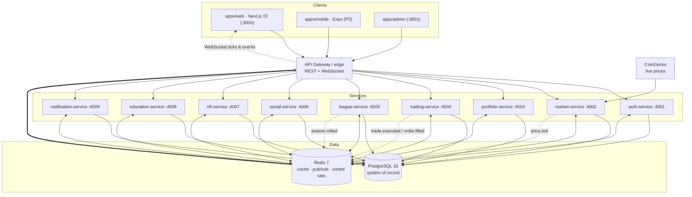
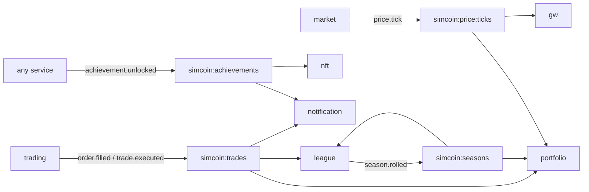

# Architecture overview

Simcoin is a pnpm + Turborepo monorepo of user-facing apps, backend microservices, and
shared packages. This document is the map; deeper detail lives in the linked docs.

- [Service reference](services.md) — responsibilities, tables, endpoints, events per service
- [Data flow](data-flow.md) — sequence diagrams for the hot paths
- [Roadmap](../roadmap.md) — which services/tables/types each phase activates
- [API conventions](../api/README.md) — auth, errors, pagination, versioning
- *Security model is documented separately in `security.md` / repo `SECURITY.md`.*

## Context

## Services

Nine NestJS services, one per bounded context. Ports are the local-dev values from
`.env.example`; in production they sit behind the gateway on Railway.

| Service | Port | Responsibility | Phase |
|---------|------|----------------|-------|
| `auth-service` | 4001 | Identity, sessions, OAuth, wallet-connect, MFA, security audit | P1 |
| `market-service` | 4002 | Ingest real, live prices and distribute ticks | P1 |
| `portfolio-service` | 4003 | Holdings, positions, mark-to-market, PnL, history | P1 |
| `trading-service` | 4004 | Order matching for the paper-trading engine | P1 |
| `league-service` | 4005 | Ranks, leaderboards, seasons, promotion/relegation | P1 / P4 |
| `social-service` | 4006 | Friends, profiles, feed, comments, likes, guilds | P2 |
| `nft-service` | 4007 | Achievement / cosmetic tokenization over chain adapters | P5 |
| `education-service` | 4008 | Lessons, progress, XP, badges, certificates | P3 |
| `notification-service` | 4009 | Email / push / in-app notifications | P1 |

See [services.md](services.md) for the full per-service contract.

## Data-store strategy

Two stores, each with a single, clear job.

**PostgreSQL 16 — system of record.** Every durable fact lives here. The canonical
schema is `database/schemas/01_schema.sql` (+ `02_auth_security.sql`); production changes
ship as forward-only files under `database/migrations/`. Notable invariants:

- `transactions` is an **immutable ledger** — every cash/asset movement is appended, never updated.
- `market_data` is the durable price time-series (for charts/audit); hot reads come from Redis.
- `seasons` has a partial unique index (`one_active_season_idx`) enforcing **one active season**.
- `sessions` stores only the **SHA-256 hash** of refresh tokens, with a rotation chain via `family_id`/`parent_id`.

**Redis 7 — cache, bus, and ranking.** Four distinct roles:

| Role | Used for |
|------|----------|
| **Cache** | Latest `PriceTick` per symbol; hot portfolio/quote reads |
| **Pub/Sub** | Cross-service domain events on `REDIS_CHANNELS` (`events.ts`) |
| **Sorted sets** | Live leaderboards — `ZADD`/`ZREVRANGE` by score (PnL %); persisted to `leaderboards` for history |
| **Session cache** | Fast session/throttle lookups for `auth-service` |

## Modularity principle

Services are decoupled by contract, never by reference. **A service never imports or
calls another service's internals.** They communicate through **domain events** defined
in `packages/types/src/events.ts`, published over **Redis pub/sub**.

The `DomainEvent` union and `REDIS_CHANNELS` map are the only coupling between services:

- `price.tick` → `simcoin:price:ticks`
- `trade.executed`, `order.filled` → `simcoin:trades`
- `achievement.unlocked` → `simcoin:achievements`
- `season.rolled` → `simcoin:seasons`

Because the contracts are stable, any module (social, education, NFT) can be enabled or
deferred without refactoring its neighbours — exactly the **modular-by-phase** product
principle.

## Realtime

Clients hold a **WebSocket** to the gateway. The gateway subscribes to the relevant
Redis channels and fans events out to connected players:

- `PriceTickEvent` for every subscribed symbol (drives charts and live PnL)
- `TradeExecutedEvent` / `OrderFilledEvent` for the player's own fills
- `AchievementUnlockedEvent` for toast/celebration UI

Access tokens are short-lived JWTs held in memory; the WebSocket authenticates with the
bearer access token (see [API conventions](../api/README.md)).

## Deployment targets

| Layer | Target |
|-------|--------|
| Web edge (`apps/web`, `apps/admin`) | **Cloudflare** |
| Services + Postgres + Redis | **Railway** |
| Analytics | **PostHog** |

Local development uses `docker compose up -d` for Postgres + Redis (the schemas are
mounted as init scripts), then `pnpm dev` runs apps and services on the host at the ports
above.
