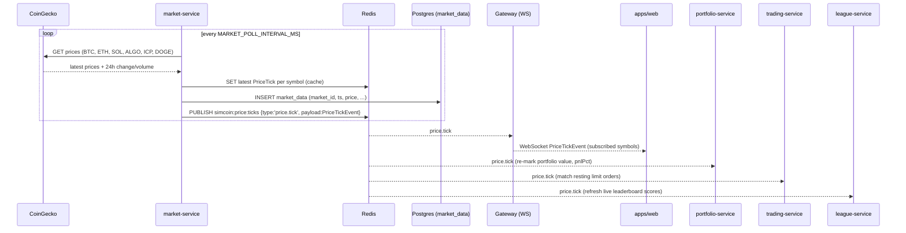

# Data flow

Sequence diagrams for Simcoin's hot paths. Every cross-service hop is a **domain event**
from [`packages/types/src/events.ts`](../../packages/types/src/events.ts) published over
Redis pub/sub on a `REDIS_CHANNELS` channel — services never call each other directly. See
the [architecture overview](README.md) and [service reference](services.md).

Channel reminder:

- `price.tick` → `simcoin:price:ticks`
- `trade.executed`, `order.filled` → `simcoin:trades`
- `achievement.unlocked` → `simcoin:achievements`
- `season.rolled` → `simcoin:seasons`

---

## (a) Live price ingestion → tick distribution

`market-service` polls the configured provider (`MARKET_DATA_PROVIDER=coingecko`) every
`MARKET_POLL_INTERVAL_MS`, caches the latest price per symbol in Redis, persists the
durable time-series to `market_data`, and publishes a `PriceTickEvent`. The gateway fans
ticks to clients over WebSocket; portfolio/league/trading services react server-side.



---

## (b) Place a market order → fill → portfolio update → achievement check

The client `POST /orders` to `trading-service`. A market order fills against the latest
cached price; `trading-service` publishes `order.filled` then `trade.executed`.
`portfolio-service` applies the fill (positions, cash, ledger) and checks portfolio-driven
achievements; `league-service` updates the leaderboard; `notification-service` notifies.

```mermaid
sequenceDiagram
  participant WEB as apps/web
  participant GW as Gateway
  participant TR as trading-service
  participant R as Redis
  participant PF as portfolio-service
  participant LG as league-service
  participant NT as notification-service

  WEB->>GW: POST /orders (PlaceOrderRequest) + Bearer
  GW->>TR: forward
  TR->>R: GET latest price (cache) for symbol
  TR->>TR: validate + fill at market price, write orders row (status=filled)
  TR->>R: PUBLISH simcoin:trades {type:'order.filled', payload:OrderFilledEvent}
  TR->>R: PUBLISH simcoin:trades {type:'trade.executed', payload:TradeExecutedEvent}
  TR-->>GW: 201 Order (status, filledQty, avgFillPrice)
  GW-->>WEB: Order

  R-->>PF: trade.executed
  PF->>PF: update positions, portfolios.cash_balance; append transactions
  PF->>PF: check achievement criteria (e.g. trade_count, season_return_pct)
  alt criterion satisfied
    PF->>R: PUBLISH simcoin:achievements {type:'achievement.unlocked', payload:AchievementUnlockedEvent}
  end

  R-->>LG: trade.executed  (update Redis sorted-set score by PnL %)
  R-->>NT: trade.executed  (fill confirmation)
  R-->>NT: achievement.unlocked (celebration)
  NT-->>GW: in-app event
  GW-->>WEB: WebSocket TradeExecutedEvent / AchievementUnlockedEvent
```

The `tradeCount` and `realizedPnl` fields on `TradeExecutedEvent` let consumers evaluate
achievement criteria like `{"type":"trade_count","gte":100}` without re-querying.

---

## (c) Season roll

At a season's `ends_at`, `league-service`'s scheduler finalises standings, applies
promotion/relegation, opens the next season (honouring the `one_active_season_idx`
single-active-season invariant), and publishes `season.rolled`. `portfolio-service`
provisions a fresh, season-scoped portfolio per player with the new season's
`starting_cash`. Achievements and `users.xp` persist across the roll.

```mermaid
sequenceDiagram
  participant SCH as league-service scheduler
  participant PG as Postgres
  participant R as Redis
  participant PF as portfolio-service
  participant NT as notification-service

  Note over SCH: season.ends_at reached
  SCH->>PG: snapshot final standings → leaderboards (scope='season')
  SCH->>PG: set leagues.promoted (top/bottom % per tier), update users.current_tier
  SCH->>PG: UPDATE seasons SET is_active=false (old); INSERT new season is_active=true
  Note right of PG: one_active_season_idx guarantees exactly one active season
  SCH->>R: PUBLISH simcoin:seasons {type:'season.rolled', payload:SeasonRolledEvent}

  R-->>PF: season.rolled
  PF->>PG: INSERT portfolios (user_id, new season_id, cash=starting_cash, starting_value)
  Note right of PF: old portfolios retained (history); achievements & XP persist

  R-->>NT: season.rolled
  NT-->>NT: send end-of-season summaries + promotion/relegation results
```

See [game-design/seasons.md](../game-design/seasons.md) and
[game-design/leagues.md](../game-design/leagues.md) for the scoring and tier rules.
</content>
