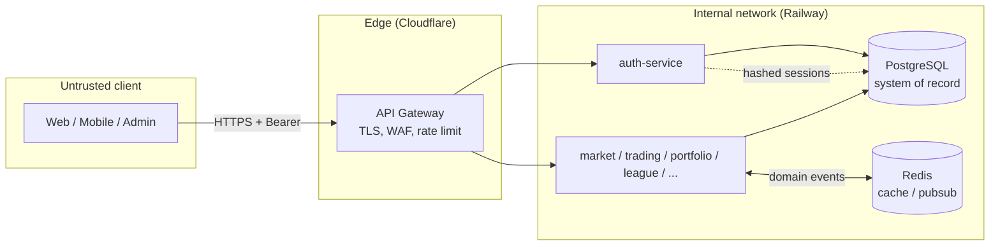
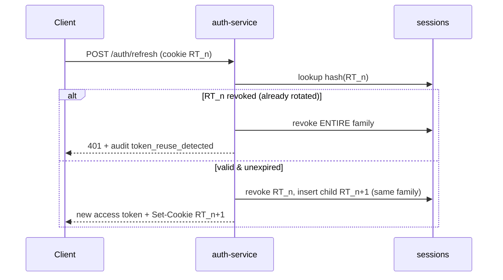

# Security Architecture & Threat Model

> Goal: the **Fort Knox of trading platforms**. Defense-in-depth, least privilege,
> auditable by default, and secure-by-construction (the safe path is the easy path).

This document describes Simcoin's security architecture, the threat model it is
designed against, and the concrete controls implemented in this repository. It
complements the top-level [`SECURITY.md`](../../SECURITY.md) and the
[`auth-service` README](../../services/auth-service/README.md).

---

## 1. Security principles

1. **Defense in depth** — no single control is load-bearing. Rate limiting,
   lockout, hashing, rotation, and audit each independently raise the cost of attack.
2. **Least privilege** — services hold only the DB grants they need; users get the
   lowest role that works; tokens are short-lived and narrowly scoped.
3. **Secure by default** — strict validation, `helmet`, locked-down CORS, HttpOnly
   cookies, and parameterised SQL are the defaults, not opt-ins.
4. **Assume breach** — a DB leak must not yield usable credentials or sessions
   (passwords are Argon2id; refresh tokens are stored only as hashes).
5. **Auditable** — every security-relevant action is recorded append-only.
6. **Optionality of risk** — real-money, wallet, and NFT features are isolated,
   opt-in modules with stricter review; they are never required to play.

---

## 2. Trust boundaries

Everything left of the gateway is **untrusted**. The gateway terminates TLS,
applies WAF/rate-limit rules, and forwards authenticated requests. Services trust
the verified JWT claims attached by the auth layer, never raw client input.

---

## 3. Authentication

### 3.1 Password storage
- **Argon2id**, memory-hard (19 MiB, t=3, p=1) — see `securityConfig.password`.
- Hashes are self-describing; on each successful login we check `needsRehash` and
  transparently upgrade to stronger parameters over time.
- Policy: ≥12 chars, weak/breached patterns rejected (HaveIBeenPwned k-anonymity
  range check wired at the service boundary).

### 3.2 No user enumeration / timing leaks
- Login returns a **generic** "invalid email or password" for both unknown users
  and wrong passwords.
- When the email is unknown we still verify against a **constant-time decoy hash**,
  so response timing does not reveal account existence.

### 3.3 Brute-force resistance
- **Per-IP rate limiting** (NestJS Throttler): login 10/min, register 5/hr,
  password-reset 5/hr.
- **Per-account lockout** after 5 failures for 15 minutes (`users.failed_login_count`,
  `users.locked_until`).

### 3.4 Multi-factor authentication
- **TOTP** (otplib). Secrets encrypted at rest (KMS-backed in prod).
- Single-use **recovery codes** stored hashed (`mfa_recovery_codes`).
- The access token carries an `mfa` claim so downstream services can require a
  satisfied second factor for sensitive actions.

### 3.5 Federated & wallet sign-in
- OAuth (Google, X) via authorization-code flow; provider subject stored in
  `auth_identities`, never the provider's tokens.
- **Wallet connect** uses a signed-nonce challenge: server issues a short-lived
  nonce (`verification_tokens`, purpose `wallet_nonce`), the wallet signs it, and
  the signature is verified by the relevant `blockchain/*` adapter. Connecting a
  wallet never exposes funds and is never required to play.

---

## 4. Sessions & tokens

| Token | Lifetime | Storage (server) | Storage (client) |
|-------|----------|------------------|------------------|
| Access (JWT) | 15 min | none (stateless, verified by signature) | in memory only |
| Refresh (opaque) | 30 days | **SHA-256 hash** in `sessions` | `HttpOnly; Secure; SameSite=strict` cookie scoped to `/auth` |

### Refresh-token rotation with reuse detection
Implemented in `SessionService` (unit-tested in `session.service.spec.ts`):

A stolen refresh token can be used at most once before the legitimate client's next
refresh trips reuse detection and nukes the family — bounding the blast radius.

Other session controls:
- "Log out everywhere" / post-password-change revokes all of a user's sessions.
- Refresh tokens carry 384 bits of entropy; only the hash is ever persisted, so a
  DB leak cannot mint sessions.

---

## 5. Authorization (RBAC)
- Roles: `player` < `creator` < `moderator` < `admin` (`users.role`).
- `JwtAuthGuard` authenticates every non-`@Public()` route; `RolesGuard` enforces
  `@Roles(...)`. Guards run in order: throttle → authenticate → authorize.
- Object-level checks (a user may only act on their own portfolio/orders) are
  enforced in each service against the verified `sub` claim.

---

## 6. Input handling & injection defense
- **SQL injection:** parameterised queries only (`DatabaseService.query(text, params)`);
  string-built SQL is forbidden by policy and reviewable in one layer.
- **Mass assignment / parameter pollution:** global `ValidationPipe` with
  `whitelist: true` + `forbidNonWhitelisted: true` strips/rejects unknown fields.
- **XSS:** React escapes by default; no `dangerouslySetInnerHTML` without review;
  `helmet` sets a strict CSP; access tokens never touch the DOM/`localStorage`.
- **CSRF:** state-changing auth uses `SameSite=strict` cookies; other mutations use
  Bearer tokens (not ambient cookies), which are immune to CSRF.
- **SSRF:** outbound calls (price providers, OAuth) target allow-listed hosts only.

---

## 7. Transport & headers
- TLS everywhere; HSTS via `helmet`.
- `helmet` defaults: CSP, `X-Content-Type-Options: nosniff`, frameguard,
  referrer policy.
- CORS restricted to configured first-party origins with `credentials: true`;
  never `*`.
- `trust proxy` is set so client IPs (for rate-limit/audit) are accurate behind
  Cloudflare/Railway.

---

## 8. Data protection
- **Secrets** come from the environment (`.env` is git-ignored); none are committed.
  CI uses ephemeral secrets.
- **PII minimization:** we store email + handle; no real-name/KYC unless a future
  regulated feature requires it (separate review).
- **Encryption at rest:** managed Postgres/Redis volumes are encrypted; MFA secrets
  are additionally application-encrypted (KMS) — `mfa_factors.secret_enc`.
- **Backups** are encrypted and access-controlled; restores are tested.

---

## 9. Audit & monitoring
- Append-only `security_audit_log` captures: logins (success/fail), logout,
  register, password change/reset, email verify, token refresh,
  **token reuse detected**, MFA events, and account lockouts.
- Audit writes are best-effort and never block the auth path; a watchdog alerts if
  the audit stream goes silent.
- Alertable signals: spikes in `login_failed`, any `token_reuse_detected`, lockout
  storms, impossible-travel logins.

---

## 10. Game-integrity threats (platform-specific)
A fantasy trading game has its own abuse surface beyond classic appsec:

| Threat | Control |
|--------|---------|
| **Price-feed manipulation / stale-price arbitrage** | Fills use server-side live prices from `market-service`, not client-supplied prices; ticks are timestamped and a max-staleness guard rejects fills on stale quotes. |
| **Order tampering** | Orders are validated server-side against the portfolio's cash/holdings; quantities/notionals are recomputed server-side. |
| **Leaderboard gaming / multi-accounting / collusion** | Device/IP signals + audit analytics flag rings; seasonal resets and percentile-based promotion limit single-account dominance; guild/wash-trade detection in `league-service`. |
| **Bot trading** | Rate limits on order placement; anomaly detection on inhuman trade cadence. |
| **Self-dealing in social/creator features** | Revenue-share and tournament payouts gated by moderation + audit review. |

---

## 11. Secure SDLC
- **CI** (`.github/workflows/ci.yml`): install (frozen lockfile) → lint → typecheck
  → build → unit tests → e2e. Security-critical logic (password hashing, session
  rotation) ships with unit tests.
- **Dependencies:** `pnpm audit` + Dependabot; lockfile pinned.
- **Secrets scanning** in CI to block accidental commits.
- **Code review:** changes touching auth/crypto/session require an explicit security
  review (see hard rules in `SECURITY.md`).

---

## 12. Roadmap hardening (post-MVP)
- Asymmetric JWT signing (RS256/EdDSA) with key rotation + JWKS.
- WebAuthn/passkeys as a first-class factor.
- Device-bound sessions (DPoP / token binding).
- Fraud/risk scoring service consuming the audit + event streams.
- Formal pen-test + bug-bounty program before any real-value feature ships.
