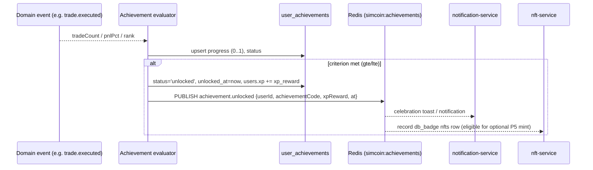

# Achievements

Achievements are the "collect them all" hook — earnable badges that pay out XP and feed
progression. They ship from day one as **DB-only badges** (the `db_badge` NFT stage) and
can *optionally* graduate to on-chain assets much later (Phase 5; never required — see
[nft-roadmap.md](../tokenomics/nft-roadmap.md)).

Backed by `achievements` (definitions) and `user_achievements` (per-player progress) in
[`01_schema.sql`](../../database/schemas/01_schema.sql); the `Achievement` /
`UserAchievement` types live in
[`achievement.ts`](../../packages/types/src/achievement.ts). Unlocks publish
`achievement.unlocked` (`AchievementUnlockedEvent`) on `simcoin:achievements`. API:
[`GET /achievements`](../api/competition.md#get-achievements).

## Catalogue (Phase 1 seed)

From [`database/seeds/01_reference.sql`](../../database/seeds/01_reference.sql):

| `code` | Name | Description | XP | Criteria (JSON) |
|--------|------|-------------|---:|-----------------|
| `first_trade` | First Trade | Place your very first order. | 50 | `{"type":"trade_count","gte":1}` |
| `hundred_trades` | Centurion | Place 100 trades. | 300 | `{"type":"trade_count","gte":100}` |
| `double_up` | 100% Gain | Double your portfolio in a single season. | 500 | `{"type":"season_return_pct","gte":100}` |
| `top_100` | Top 100 Finish | Finish a season ranked in the top 100. | 400 | `{"type":"season_rank","lte":100}` |

`achievements` columns: `code` (stable identifier), `name`, `description`, `icon`,
`xp_reward`, and the machine-checkable `criteria` (JSONB).

## Criteria JSON shape

`criteria` is a small, declarative, machine-checkable rule the evaluator reads — no code
change to add a new achievement. Observed shapes:

```jsonc
// count-based, met when the metric is >= a threshold
{ "type": "trade_count",       "gte": 1 }
{ "type": "trade_count",       "gte": 100 }
// percentage return within a season, >= threshold
{ "type": "season_return_pct", "gte": 100 }
// rank-based, met when rank is <= a threshold (lower rank = better)
{ "type": "season_rank",       "lte": 100 }
```

| Key | Meaning |
|-----|---------|
| `type` | The metric to evaluate (`trade_count`, `season_return_pct`, `season_rank`, …) |
| `gte` | Met when `metric >= value` (counts, returns) |
| `lte` | Met when `metric <= value` (ranks, where lower is better) |

The relevant metrics arrive on domain events without extra queries:
`TradeExecutedEvent.tradeCount` feeds `trade_count`; portfolio `pnlPct` feeds
`season_return_pct`; final standings feed `season_rank`.

## How `user_achievements` tracks progress

One row per (player, achievement), unique on `(user_id, achievement_id)`:

| Column | Type | Meaning |
|--------|------|---------|
| `status` | `achievement_status` | `locked` → `in_progress` → `unlocked` |
| `progress` | `NUMERIC(6,4)` | Fractional progress, **0..1** (e.g. 42 of 100 trades = `0.4200`) |
| `unlocked_at` | timestamptz | Set when the criterion is first satisfied |

The `UserAchievement` API type wraps the full `Achievement` plus `status`, `progress`, and
`unlockedAt`, so the client can render both "earned" badges and progress bars for
in-progress ones.

## Unlock flow



Unlocking credits `xp_reward` to lifetime `users.xp` and emits
`AchievementUnlockedEvent { userId, achievementCode, xpReward, at }`. The event drives the
celebration UI (`notification-service`) and, in Phase 5, lets `nft-service` record the
badge for optional tokenization. XP and unlocked achievements **persist across season
resets** (see [seasons.md](seasons.md)).
</content>
