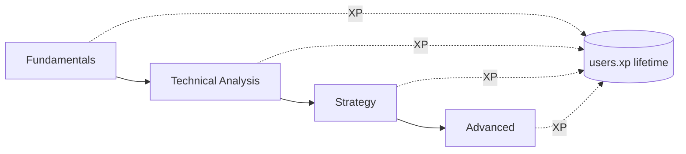

# Education

The "Duolingo" layer (Phase 3): bite-sized lessons that teach crypto and trading concepts,
pay out XP, and award badges/certificates on module completion. Learning feeds the same
progression currency as playing — lifetime `users.xp` — so studying and trading reinforce
each other.

Backed by `lessons` and `lesson_progress`
([`01_schema.sql`](../../database/schemas/01_schema.sql)); the `Lesson` /
`LessonProgress` types live in
[`education.ts`](../../packages/types/src/education.ts). Served by `education-service`
(`:4008`). Catalogue seeded in
[`database/seeds/01_reference.sql`](../../database/seeds/01_reference.sql).

## Modules & starter catalogue

Lessons are grouped into four modules via `lessons.module`, ordered within a module by
`lessons.ordering`:

| Module | Lesson (`slug`) | Title | XP |
|--------|-----------------|-------|---:|
| **Fundamentals** | `what-is-bitcoin` | What is Bitcoin? | 25 |
| **Fundamentals** | `what-is-a-wallet` | What is a Wallet? | 25 |
| **Technical Analysis** | `technical-analysis` | Technical Analysis 101 | 40 |
| **Technical Analysis** | `rsi` | Reading the RSI | 40 |
| **Technical Analysis** | `macd` | Understanding MACD | 40 |
| **Strategy** | `risk-management` | Risk Management | 50 |
| **Advanced** | `defi` | Intro to DeFi | 60 |
| **Advanced** | `nfts` | Understanding NFTs | 60 |

XP scales with difficulty: Fundamentals (25) → Technical Analysis (40) → Strategy (50) →
Advanced (60). Lesson content is structured JSON (`lessons.body`, e.g.
`{"sections":[...]}`) rendered by the lesson player; quizzes produce a score.

## Progression

- Players progress within a module by `ordering`, and broadly from Fundamentals → Advanced.
- Each completed lesson credits its `xp_reward` to **lifetime `users.xp`** — the same XP
  shown on the profile and earned from achievements; it never resets between seasons.
- A quiz yields a `score` (0..1) recorded per lesson.

## Tracking: `lesson_progress`

One row per (player, lesson), primary key `(user_id, lesson_id)`:

| Column | Type | Meaning |
|--------|------|---------|
| `completed` | boolean | Lesson finished |
| `score` | `NUMERIC(6,4)` | Quiz score, 0..1 (nullable until taken) |
| `completed_at` | timestamptz | Completion timestamp |

The `LessonProgress` API type exposes `lessonId`, `completed`, `score`, and `completedAt`.

## XP, badges, and certificates

- **XP** — per-lesson, credited to `users.xp` on completion (drives the global
  progression/level shown across the app).
- **Badges** — completing a module grants a badge, surfaced through the achievements system
  (an `achievement.unlocked` event → celebration + DB badge). See
  [achievements.md](achievements.md).
- **Certificates** — finishing a full track (e.g. all Technical Analysis lessons) awards a
  module certificate, a shareable credential on the player's profile.

Education is **never a prerequisite to play** — it's an additive module that can be enabled
or deferred per the modular-by-phase principle, but it shares progression (XP) with the
core trading loop so the two compound.
</content>
