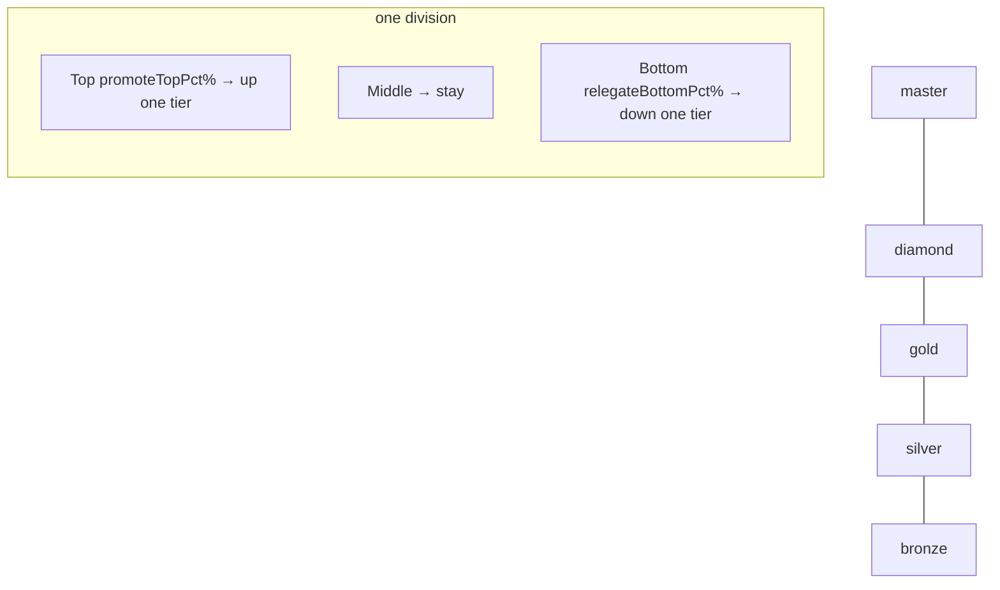

# Leagues

Leagues are Simcoin's competitive ladder — the "Clash Royale seasons" half of the pitch.
Every player is placed in a **tier** and a **division** for the active season; performance
(PnL %) determines rank, and the season roll promotes the top and relegates the bottom.

Backed by `leagues`, `seasons`, and `leaderboards`
([`01_schema.sql`](../../database/schemas/01_schema.sql)), and the
`LeagueTier` / `LeagueMembership` / `LeaderboardEntry` types in
[`competition.ts`](../../packages/types/src/competition.ts). API:
[competition.md](../api/competition.md).

## Tiers

Five tiers, ordered by the `league_tier` enum and the `LeagueTier.rank` field
(bronze = 0 … master = 4):

| Tier | rank | Notes |
|------|-----:|-------|
| `bronze` | 0 | Entry tier; new accounts start here (`users.current_tier` default) |
| `silver` | 1 | |
| `gold` | 2 | |
| `diamond` | 3 | |
| `master` | 4 | Top tier; relegation only, no promotion above |

A player's current tier is denormalised on `users.current_tier` and tracked per season on
`leagues.tier`.

## Divisions

Each tier is split into **divisions** (`leagues.division`, a small integer starting at 1)
so that ranking happens within manageable groups rather than one giant ladder. A division
holds a bounded cohort of players in the same tier; promotion/relegation is evaluated
within the division's standings. This keeps the "I can see myself climbing" feel even with
a large player base.

## Scoring

Rank is by **portfolio return** — PnL % vs the portfolio's `startingValue` — not absolute
dollars, so everyone competes on equal footing regardless of starting cash. This is the
`score` stored on `leaderboards` and `LeaderboardEntry.score`.

- Live ordering lives in **Redis sorted sets** (`ZADD`/`ZREVRANGE`), updated as
  `trade.executed` and `price.tick` events move portfolio values
  (see [data-flow](../architecture/data-flow.md)).
- Snapshots persist to `leaderboards` (`scope`, `period_key`, `rank`, `score`) for
  history and audit. Scopes: `daily`, `weekly`, `monthly`, `all_time`, `season`.

## Promotion & relegation

At the season roll, `league-service` finalises each division's standings and applies
movement between tiers. The fractions are driven by `LeagueTier.promoteTopPct` and
`relegateBottomPct`:

- The **top `promoteTopPct`** of a division move up one tier (no promotion above `master`).
- The **bottom `relegateBottomPct`** move down one tier (no relegation below `bronze`).
- The middle band keeps its tier.

The outcome per player is recorded on `leagues.promoted` (`true`/`false`, `null`
mid-season) and `users.current_tier` is updated. Concrete percentages are configuration on
the tier definitions (game-engine), tuned to keep tier populations stable and climbing
feel achievable.

## Seasons

Leagues reset on the 30-day season cadence: standings finalise, promotion/relegation
applies, a fresh portfolio is granted, and the new season's ladder opens. Identity, XP,
and achievements persist across the roll. Full detail: [seasons.md](seasons.md).
</content>
