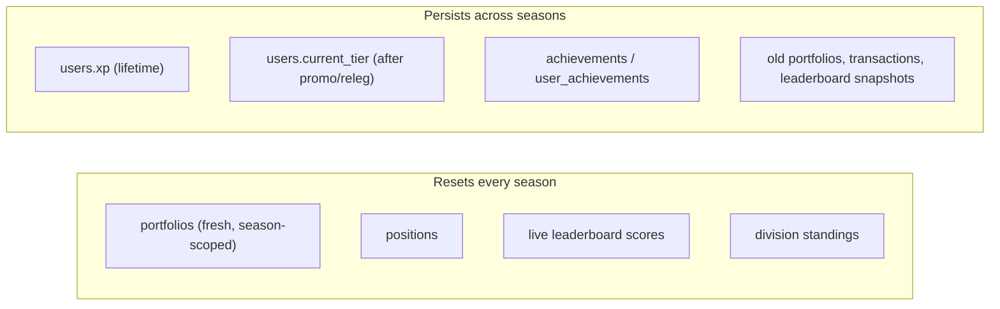

# Seasons

Seasons are Simcoin's **retention engine** (Phase 4). Every 30 days the competitive slate
wipes clean: portfolios reset to a fresh balance, leagues promote/relegate, and a new race
begins — while identity, XP, and achievements persist. A clean restart every month gives
lapsed players a reason to return and gives everyone a fair, comparable run.

Backed by `seasons` and the `season_id` scoping on `portfolios` and `leagues`
([`01_schema.sql`](../../database/schemas/01_schema.sql)), the `Season` type in
[`competition.ts`](../../packages/types/src/competition.ts), and the `season.rolled`
event (`SeasonRolledEvent`) in [`events.ts`](../../packages/types/src/events.ts).

## Cadence

- **30 days per season.** The genesis season is seeded as `Season 1`,
  `now() … now() + INTERVAL '30 days'`, `is_active = TRUE`
  ([`01_reference.sql`](../../database/seeds/01_reference.sql)).
- **Exactly one active season** at any time, enforced by the partial unique index
  `one_active_season_idx ON seasons (is_active) WHERE is_active`.
- **Starting cash:** `$100,000` simulated USD (`seasons.starting_cash`, default `100000`).

## What resets vs. what persists

| Resets | Persists |
|--------|----------|
| **Portfolio** — a new `portfolios` row is created per player, scoped to the new `season_id`, with `cash_balance = starting_cash`. The `UNIQUE (user_id, season_id)` constraint guarantees one portfolio per player per season. | **Achievements & progress** — `achievements` definitions and each player's `user_achievements` (status/progress/unlocked_at) carry over. |
| **Positions & live scores** — open holdings and the Redis sorted-set leaderboard start empty. | **XP** — `users.xp` is lifetime and only ever accrues (drives the education/progression layer). |
| **Division standings** — the ladder restarts after promotion/relegation is applied. | **History** — prior `portfolios`, the immutable `transactions` ledger, and `leaderboards` snapshots (`scope='season'`) are retained for the player's record. |

Note the design intent in the schema: portfolios are *"scoped to a season so that seasonal
resets create a fresh portfolio while preserving history."* Old portfolios are never
deleted — they remain queryable for past-season stats.

## The season roll

When `seasons.ends_at` is reached, `league-service`'s scheduler:

1. Snapshots final standings into `leaderboards` (`scope='season'`).
2. Applies promotion/relegation (see [leagues.md](leagues.md)), writing
   `leagues.promoted` and updating `users.current_tier`.
3. Flips the old season `is_active = false` and opens a new one `is_active = true`.
4. Publishes `season.rolled` (`SeasonRolledEvent { previousSeasonId, newSeasonId, at }`)
   on `simcoin:seasons`.

`portfolio-service` consumes the event and provisions each player's fresh portfolio
(recorded as a `season_grant` transaction). Full sequence:
[data-flow (c) Season roll](../architecture/data-flow.md#c-season-roll).

## Rewards & trophies

End-of-season payouts reward placement and reinforce the climb:

- **Trophies / season badges** for finishing in a tier (especially `master`) — surfaced as
  achievements (e.g. `top_100`, "Top 100 Finish", 400 XP).
- **XP grants** added to lifetime `users.xp`.
- **Rewards** recorded on the ledger as `reward` transactions where applicable.
- Cosmetic / NFT rewards are an *optional* later layer (Phase 5) — never required to play.

## Retention rationale

- **Fresh start, fair comparison.** Resetting portfolios means a single lucky early trade
  can't dominate forever; every season is a new, comparable 100k → ? race.
- **Recurring deadline.** A 30-day clock and end-of-season rewards create a natural
  return cadence — the core loop behind "Clash Royale seasons."
- **Loss aversion via relegation + persistent progress.** Players defend their tier
  (don't want to drop) while XP and achievements that never reset reward long-term play —
  so a bad season costs standing, not the whole account.
</content>
