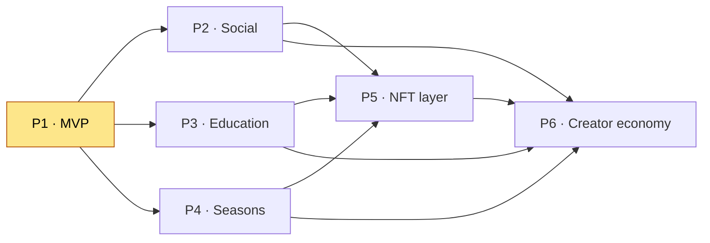

# Simcoin Roadmap

Simcoin — **"Duolingo for crypto trading"** — ships in six phases. The core product
(paper trading against live prices, leaderboards, rank leagues, seasons, education) is
delivered first; everything else is a module behind a stable interface that can be
enabled or deferred without refactoring (see [Product principles](../README.md#product-principles)).

> **MVP target: 45–60 days.** Phase 1 is the only phase with a hard time box. Later
> phases are sequenced by dependency, not date.

Each phase "activates" specific services (`services/*`), tables
(`database/schemas/*.sql`), and types (`packages/types/src/*.ts`). The phase legend in
`database/schemas/01_schema.sql` (`[P1]…[P5]`) is the canonical tag for every table.

---

## Phase 1 — MVP (45–60 days)

The playable core: sign up, trade simulated assets against real prices, see your PnL,
and climb a leaderboard. No real money, no real risk.

**Features**

- [ ] Authentication: email/password register + login, refresh-token rotation, `/auth/me`
- [ ] OAuth (`google`, `x`) and wallet-connect (`algorand`/`solana`/`icp`) sign-in (stubs → live)
- [ ] MFA (TOTP) enrollment with recovery codes
- [ ] Live market engine: ingest BTC, ETH, SOL, ALGO, ICP, DOGE from CoinGecko
- [ ] Price-tick distribution over WebSocket + Redis cache
- [ ] Paper-trading order placement (market + limit), order matching, fills
- [ ] Portfolio: cash balance, positions, mark-to-market value, PnL %
- [ ] Immutable transaction ledger
- [ ] Rank leagues (bronze → master) with divisions
- [ ] Leaderboards (daily / weekly / monthly / all-time / season) backed by Redis sorted sets
- [ ] DB-only achievements (`db_badge` stage) with XP rewards
- [ ] In-app + email notifications for fills and unlocks

**Services activated:** `auth-service` (`:4001`), `market-service` (`:4002`),
`portfolio-service` (`:4003`), `trading-service` (`:4004`), `league-service` (`:4005`),
`notification-service` (`:4009`).

**Tables activated:** `users`, `auth_identities`, `wallets`, `sessions`,
`verification_tokens`, `mfa_factors`, `mfa_recovery_codes`, `security_audit_log`,
`markets`, `market_data`, `portfolios`, `positions`, `orders`, `transactions`,
`seasons`, `leagues`, `leaderboards`, `achievements`, `user_achievements`. (`nfts` rows
exist only at the `db_badge` stage in P1.)

**Types activated:** `auth.ts`, `market.ts`, `trading.ts`, `competition.ts`,
`achievement.ts`, and the `events.ts` channels `price.tick`, `order.filled`,
`trade.executed`, `achievement.unlocked`, `user.registered`.

**Dependencies:** none — this is the foundation every later phase builds on.

---

## Phase 2 — Social

Turn solo trading into a network: profiles, friends, and a trade feed.

**Features**

- [ ] Public player profiles (handle, avatar, tier, XP, stats)
- [ ] Friend requests / accept / block
- [ ] Following + a chronological trade feed
- [ ] "I just traded" cards linking a `transactions` row
- [ ] Comments and likes on posts
- [ ] Guilds (group membership)

**Services activated:** `social-service` (`:4006`).

**Tables activated:** `friends`, `posts`, `comments` (all tagged `[P2]`).

**Types activated:** `social.ts` (`Friendship`, `Post`, `Comment`).

**Dependencies:** Phase 1 (needs `users`, and `transactions` for trade cards).

---

## Phase 3 — Education

The "Duolingo" layer: structured lessons that pay out XP and feed progression.

**Features**

- [ ] Lesson modules: **Fundamentals**, **Technical Analysis**, **Strategy**, **Advanced**
- [ ] Lesson player with structured `body` content + quizzes
- [ ] Per-lesson XP rewards credited to `users.xp`
- [ ] Progress tracking and quiz scores
- [ ] Badges and certificates on module completion

**Services activated:** `education-service` (`:4008`).

**Tables activated:** `lessons`, `lesson_progress` (tagged `[P3]`); writes `users.xp`.

**Types activated:** `education.ts` (`Lesson`, `LessonProgress`).

**Dependencies:** Phase 1 (XP on `users`). See [`game-design/education.md`](game-design/education.md).

---

## Phase 4 — Seasons (the retention engine)

30-day competitive cycles. Portfolios reset; identity and progression persist.

**Features**

- [ ] 30-day season cadence with one active season at a time
- [ ] Season roll: archive standings, create a fresh `$100k` portfolio per player
- [ ] Promotion / relegation between league tiers at season end
- [ ] Season rewards and trophies
- [ ] Recurring challenges

**Services activated:** `league-service` owns the season scheduler (built in P1, fully
exercised in P4).

**Tables activated:** `seasons`, the `season_id` scoping on `portfolios` and `leagues`,
and `leaderboards (scope = 'season')`.

**Types activated:** `competition.ts` (`Season`, `LeagueMembership`) and the
`events.ts` channel `season.rolled` (`SeasonRolledEvent`).

**Dependencies:** Phase 1 (leagues, portfolios). See
[`game-design/seasons.md`](game-design/seasons.md) and
[`architecture/data-flow.md`](architecture/data-flow.md#c-season-roll).

---

## Phase 5 — NFT layer

Progressive tokenization. Achievements that already exist as DB badges can *optionally*
graduate to on-chain assets — never a prerequisite to play.

**Features**

- [ ] `db_badge` → `nft_badge`: mint an earned achievement as an NFT
- [ ] `cosmetic`: tradable cosmetic items
- [ ] `marketplace`: peer-to-peer trading of cosmetics
- [ ] `ChainMinter` adapter abstraction over `algorand` / `solana` / `icp`
- [ ] Wallet linking required only at mint time

**Services activated:** `nft-service` (`:4007`), plus the `blockchain/*` adapters.

**Tables activated:** `nfts` advances through the `nft_stage` enum; `wallets` used at mint.

**Types activated:** `achievement.ts` (`Nft`, `NftStage`).

**Dependencies:** Phase 1 (achievements). See
[`tokenomics/nft-roadmap.md`](tokenomics/nft-roadmap.md).

---

## Phase 6 — Creator economy

Players become producers: user-made challenges, tournaments, leagues, and courses with
revenue share. Unlocks the `creator` role (already present in `app_role`).

**Features**

- [ ] Player-created challenges and tournaments
- [ ] Custom leagues
- [ ] Player-authored courses
- [ ] Revenue share for creators

**Services activated:** extends `league-service`, `education-service`, `social-service`.

**Roles:** the `creator` value of `app_role` (defined in `02_auth_security.sql`) becomes
fully active.

**Dependencies:** Phases 2, 3, 4, and 5 — creators build on social graph, education,
seasons, and the cosmetic/NFT economy.

---

## Phase summary

| Phase | Theme | Services activated | Headline tables |
|------:|-------|--------------------|-----------------|
| **1** | MVP (45–60 days) | auth, market, portfolio, trading, league, notification | users, markets, orders, portfolios, leaderboards, achievements |
| **2** | Social | social | friends, posts, comments |
| **3** | Education | education | lessons, lesson_progress |
| **4** | Seasons | league (scheduler) | seasons, leagues |
| **5** | NFT layer | nft + blockchain adapters | nfts, wallets |
| **6** | Creator economy | league, education, social | (creator extensions) |
