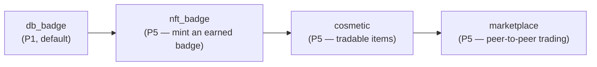
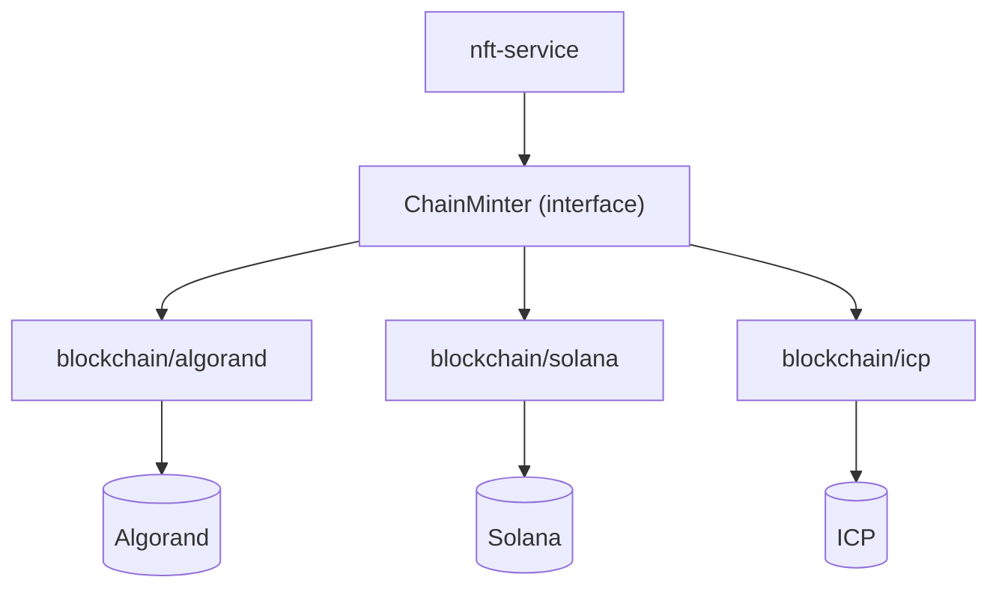
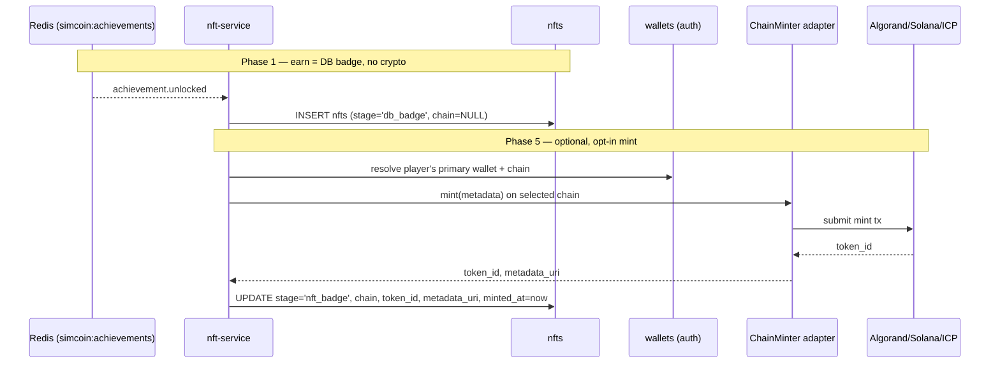

# NFT roadmap

Simcoin treats NFTs as an **optional expansion, never a prerequisite**. The entire reward
system — achievements, badges, cosmetics — works fully without a wallet or a blockchain.
Tokenization is a progressive, opt-in graduation of things that already exist as database
records. This is a direct expression of [Product principle #1](../../README.md#product-principles):
*"Crypto, wallets, and NFTs are optional expansions, never prerequisites to play."*

Backed by the `nfts` table and the `nft_stage` / `chain_kind` enums
([`01_schema.sql`](../../database/schemas/01_schema.sql)); the `Nft` / `NftStage` types
live in [`achievement.ts`](../../packages/types/src/achievement.ts). Owned by
`nft-service` (`:4007`, Phase 5).

## Progressive rollout: the four stages

The `nft_stage` enum encodes the rollout order. An achievement starts life as a pure DB
record and can advance — optionally — toward a tradable on-chain asset:

| Stage | Phase | What it is |
|-------|-------|-----------|
| `db_badge` | **P1** (default) | A badge that lives only in Postgres. Every earned achievement records an `nfts` row at this stage (`stage='db_badge'`, `chain=NULL`). Fully playable, zero crypto. |
| `nft_badge` | P5 | A `db_badge` the player *chooses* to mint on-chain. `chain`, `token_id`, `metadata_uri`, `minted_at` get populated. |
| `cosmetic` | P5 | Tradable cosmetic items (skins, frames) beyond achievement badges. |
| `marketplace` | P5 | Peer-to-peer trading of cosmetics between players. |

`nfts.stage` defaults to `db_badge`; `chain`, `token_id`, `metadata_uri`, and `minted_at`
are all `NULL` until something is actually minted. `source_achievement` links a badge back
to the `achievements` row it came from.

## Why NFTs are deferred to Phase 5 (and never required)

- **The core loop needs no chain.** Trading against live prices, leaderboards, leagues,
  seasons, and education are the product (Phases 1–4). Achievements already reward players
  via XP and DB badges from day one.
- **Modular-by-phase.** The reward system is built so the on-chain layer can be enabled or
  deferred without refactoring its neighbours. `nft-service` simply consumes
  `achievement.unlocked` and advances `nfts` rows — nothing upstream depends on it.
- **No barrier to entry.** Requiring a wallet would gate the game behind crypto literacy
  and friction. Wallet linking (`wallets`, via auth-service) is needed **only at mint
  time**, and even then only for players who opt in.
- **Real data, simulated stakes.** Prices are real; balances and rewards are fake by
  default. NFTs add *optional* real ownership on top, not a real-money requirement.

## ChainMinter: the adapter abstraction

`nft-service` never talks to a specific chain SDK directly. Minting goes through a
**`ChainMinter`** interface, with one adapter per supported chain under `blockchain/*`
(`algorand`, `solana`, `icp`) — matching the `chain_kind` enum. The adapter is selected at
mint time from the player's connected wallet's `chain`.

This keeps chain choice pluggable: adding or swapping a chain is a new adapter behind the
stable `ChainMinter` contract, with no change to the service's domain logic. Per the
repo layout, chain adapters are *"added later, never required."*

## The `nfts` table

| Column | Type | Meaning |
|--------|------|---------|
| `id` | UUID | PK |
| `user_id` | UUID → `users` | Owner |
| `source_achievement` | UUID → `achievements`? | The badge this NFT derives from (nullable for pure cosmetics) |
| `stage` | `nft_stage` | `db_badge` (default) → `nft_badge` → `cosmetic` → `marketplace` |
| `chain` | `chain_kind`? | `algorand`/`solana`/`icp`; **null until minted** |
| `token_id` | text? | On-chain id, set at mint |
| `metadata_uri` | text? | Metadata pointer, set at mint |
| `minted_at` | timestamptz? | Null until minted |
| `created_at` | timestamptz | Row creation (badge earned) |

## Lifecycle

A player who never connects a wallet still earns and keeps every badge — they simply stay
at `db_badge` forever, which is a complete experience.
</content>
